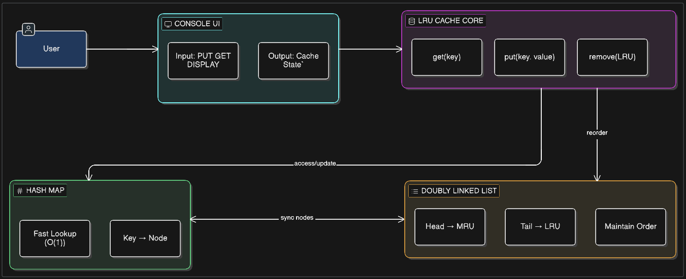

# LRU Cache Implementation

## 📌 Project Overview
This project implements a **Least Recently Used (LRU) Cache** using efficient data structures.  
The cache stores a limited number of key-value pairs and ensures that the most recently used data is easily accessible while removing the least recently used data when the cache reaches its capacity.

This implementation is designed to achieve **O(1) time complexity** for both insertion and retrieval operations.

---

## 🎯 Objectives
- To design an efficient cache system
- To implement LRU replacement policy
- To achieve constant time operations
- To understand real-world use of data structures

---

## 🛠️ Technologies Used
- Programming Language: C++
- Concepts: Data Structures, Algorithms, Memory Management

---

## 🧠 Data Structures Used

### 1. Hash Map (`unordered_map`)
- Stores key → node mapping
- Provides **O(1)** lookup time

### 2. Doubly Linked List
- Maintains order of usage
- Head → Most Recently Used (MRU)
- Tail → Least Recently Used (LRU)

---

## ⚙️ How It Works

### 🔹 PUT Operation
1. If key already exists → update value and move to front  
2. If key is new:
   - If cache is full → remove LRU (tail node)
   - Insert new node at front (MRU position)

### 🔹 GET Operation
1. If key not found → return -1  
2. If found:
   - Move node to front (MRU)
   - Return value  

---

## 🔄 Flow of System
1. User gives input (PUT / GET / DISPLAY)
2. Cache processes request
3. Hash map provides fast access
4. Linked list updates usage order
5. LRU element is removed when needed

---
## Architecture

---

## ⏱️ Time Complexity
| Operation | Complexity |
|----------|-----------|
| GET      | O(1)      |
| PUT      | O(1)      |
| DELETE   | O(1)      |

---

## 📊 Space Complexity
- O(N), where N = cache capacity

---

## 🧪 Features
- Fast data access
- Efficient memory usage
- Dynamic updates
- Menu-driven interface for demonstration

---

## 🌍 Real-World Example

### Web Browser Cache
When you visit a website:
- The browser stores images, scripts, and pages in cache
- Frequently visited pages load faster
- If cache is full:
  - Least recently used pages are removed
- This improves performance and reduces loading time

---

## 🚀 Future Improvements
- Add Time-To-Live (TTL) for expiration
- Add GUI for better visualization
- Multi-threaded support
- Persistent storage

---

## 📌 Conclusion
This project demonstrates how combining a hash map with a doubly linked list creates an efficient LRU cache. It highlights the importance of data structures in building high-performance systems.

---
